# Kubernetes Deployment of Churn API – MLOps Lab

## Overview
This lab demonstrates how to deploy a churn prediction API on Kubernetes using Docker, ConfigMaps, Secrets, probes, persistent volumes, and network policies.

---

## Step 1 – Prepare the Kubernetes Environment
We prepared the local Kubernetes environment (Minikube) and verified cluster access.

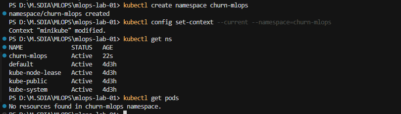

---

## Step 2 – Prepare the Docker Image for the Churn API
We ensured the API source code and Dockerfile were ready for containerization.

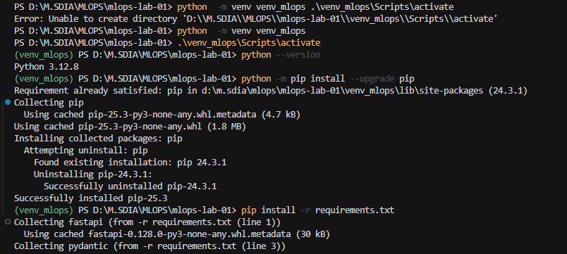

---

## Step 3 – Create the Kubernetes Manifests Directory
We created the `k8s/` directory to store all Kubernetes manifest files.

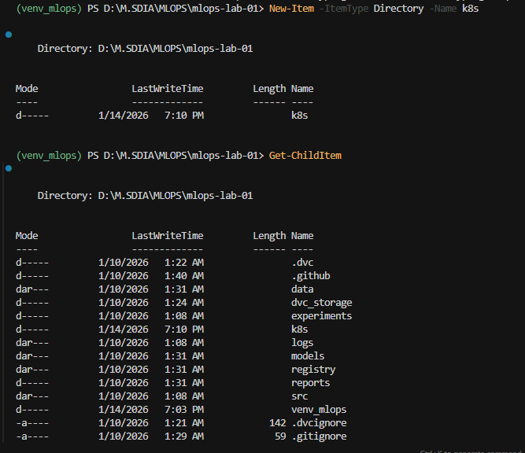

---

## Step 4 – Build the Docker Image (Versioned Tag)
We built the Docker image for the API with a versioned tag.

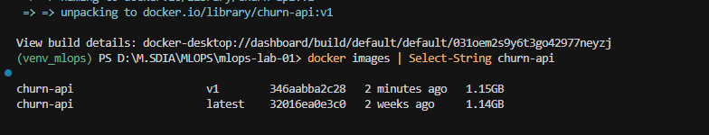

---

## Step 5 – Load the Docker Image into Minikube
We explicitly loaded the Docker image into Minikube so it can be used by Kubernetes.

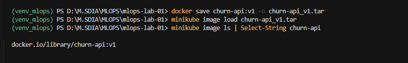

---

## Step 6 – Kubernetes Deployment for the Churn API
We created and applied the Deployment manifest to run the API in Kubernetes.

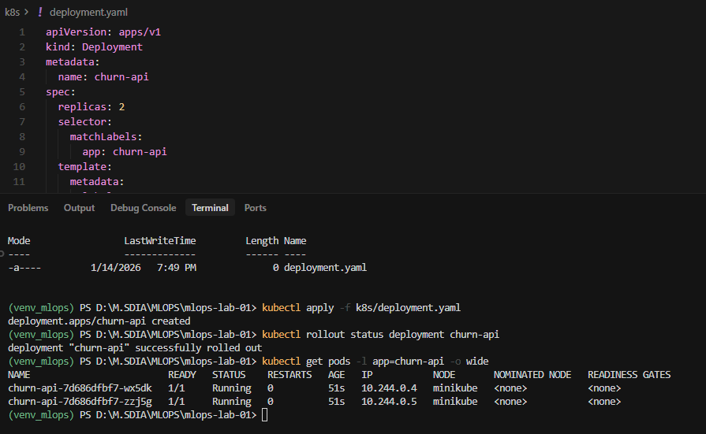

---

## Step 7 – Expose the API via a NodePort Service
We exposed the API externally using a Kubernetes NodePort Service.

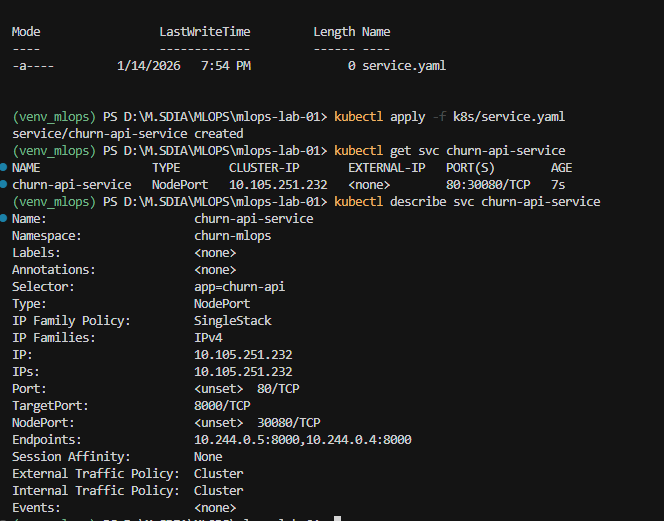
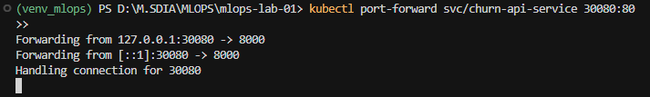
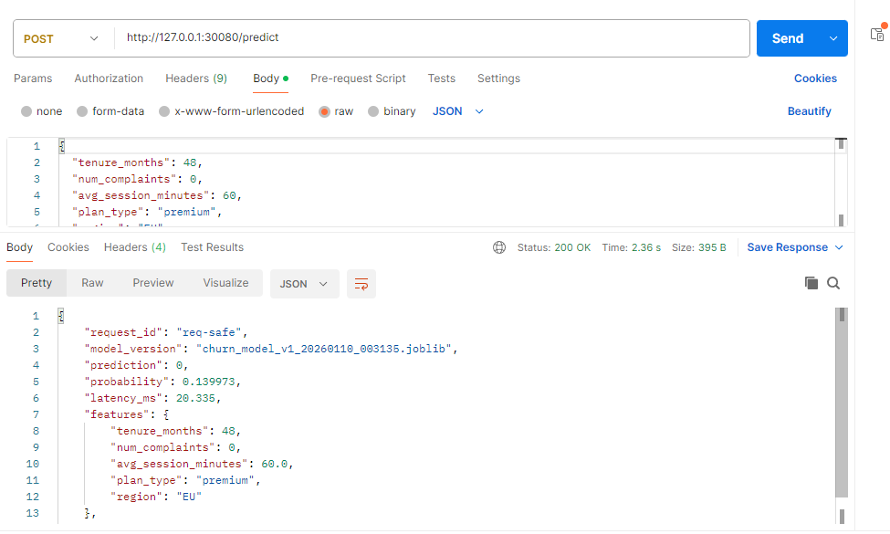

---

## Step 8 – Inject Configuration via ConfigMap
We injected configuration values into the API using a Kubernetes ConfigMap.

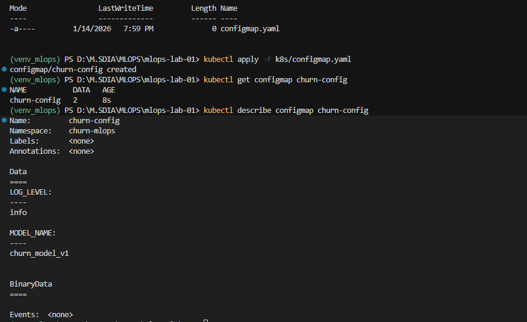
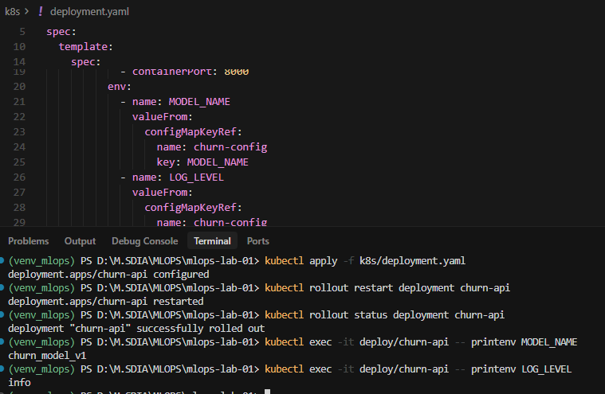

---

## Step 9 – Manage Secrets (MONITORING_TOKEN)
We securely injected sensitive data using a Kubernetes Secret.

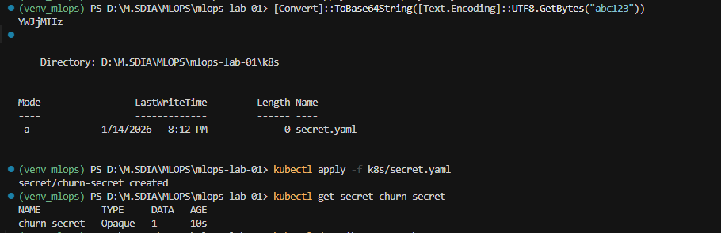
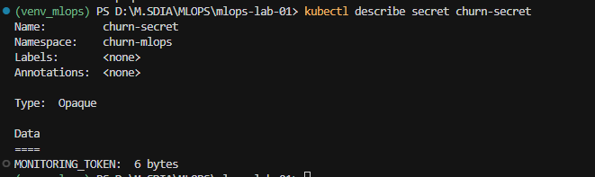
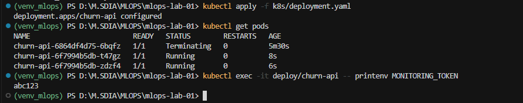

---

## Step 10 – Health Endpoints for the API
We implemented health endpoints (`/health`, `/ready`, `/startup`) in the API.

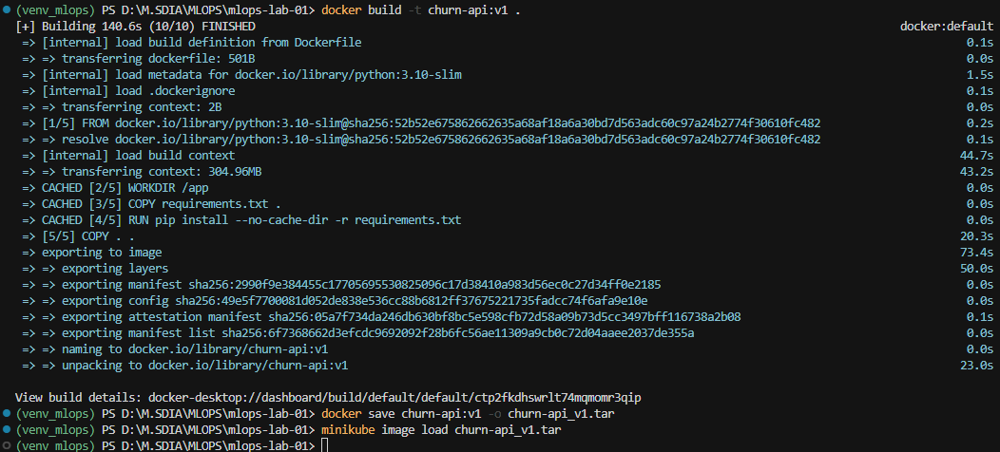
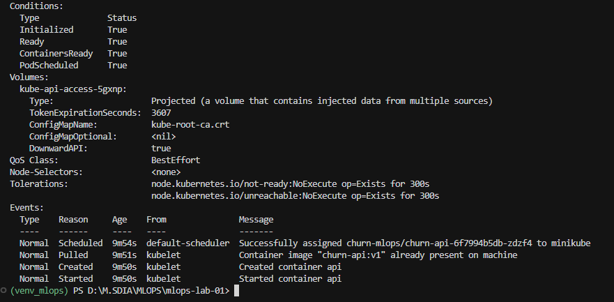

---

## Step 11 – Add Kubernetes Probes
We configured liveness, readiness, and startup probes in the Deployment.

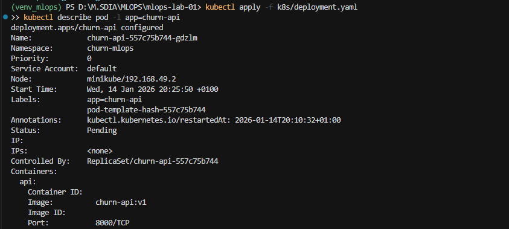
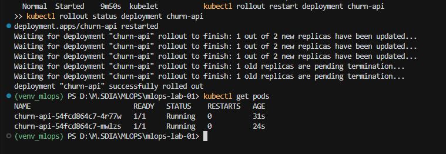

---

## Step 12 – Persistent Volume for Registry and Logs
We mounted a PersistentVolumeClaim to store models, registry data, and logs.

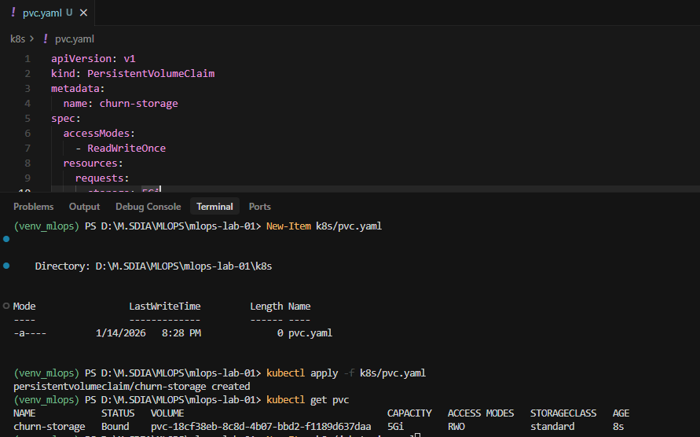
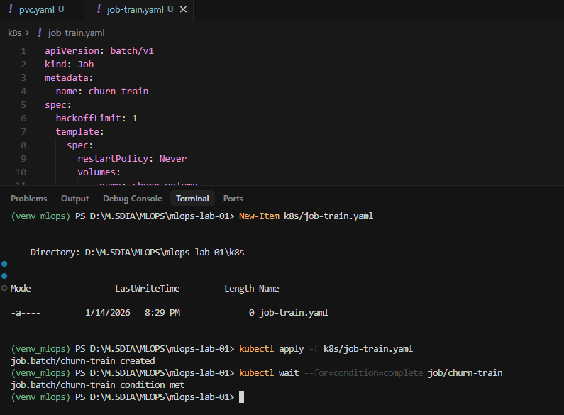
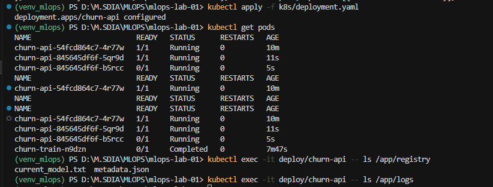

---

## Step 13 – NetworkPolicy
We applied a NetworkPolicy to control network access to the API pods.

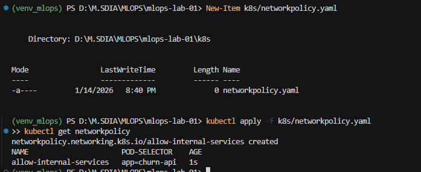

---

## Step 14 – Final Verification
We verified pods, services, logs, API availability, and overall system health.

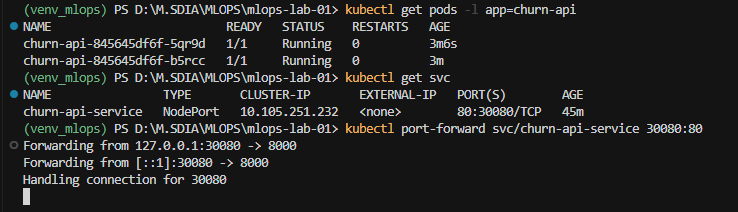
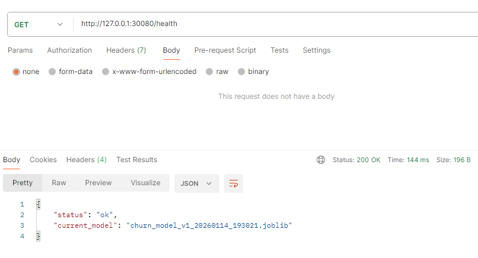
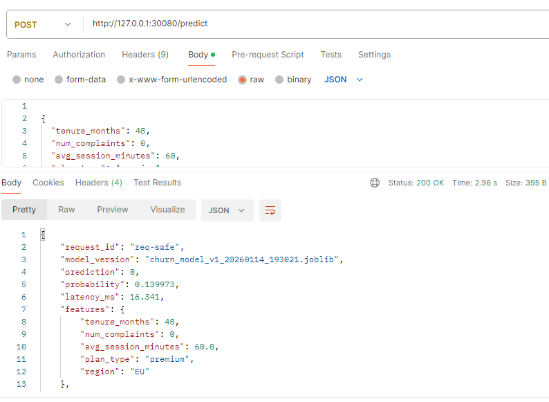
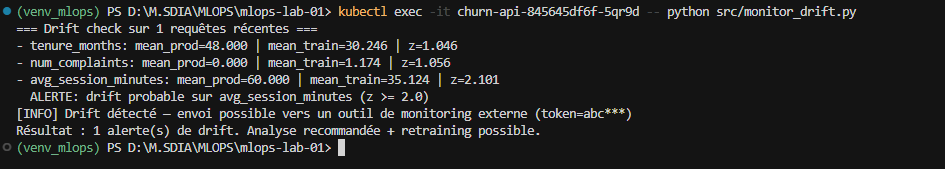

---
