# MLflow Model Lifecycle – Churn Prediction (MLOps Lab)

## Overview
This lab demonstrates a complete MLflow-based MLOps workflow for managing the lifecycle of a churn prediction model.

---

## Step 1 – Environment Initialization and MLflow Installation
We initialized the Python environment and installed MLflow and the required dependencies.

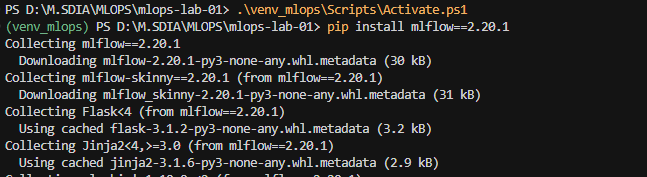

---

## Step 2 – Creation of the MLflow Storage Space
We explicitly created the directories used by MLflow to store experiments, artifacts, and models.

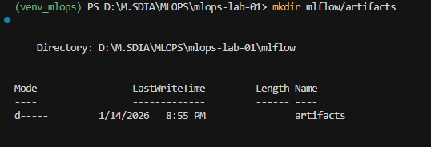

---

## Step 3 – MLflow Client Configuration
We configured the MLflow tracking URI so that all runs are logged to the same tracking server.

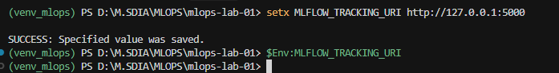

---

## Step 4 – Starting the MLflow Tracking Server
We started the MLflow tracking server and accessed the MLflow UI locally.

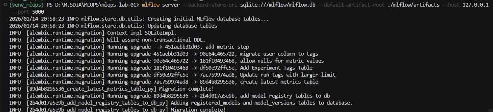
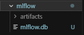
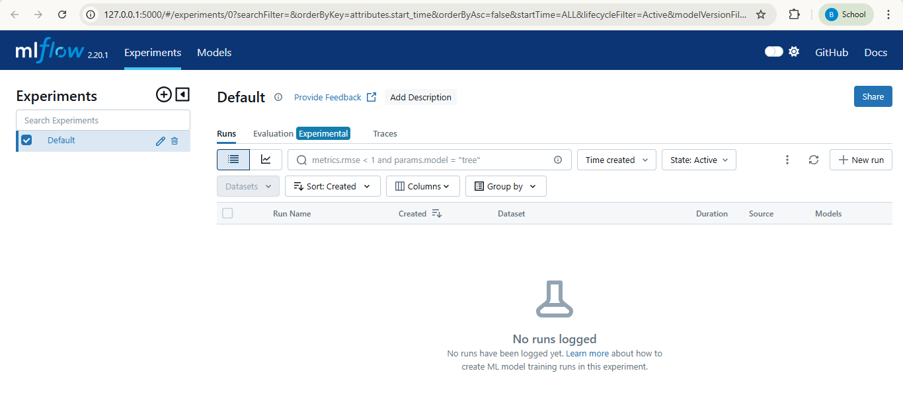

---

## Step 5 – Instrumentation of `train.py`
We instrumented the training script to log parameters, metrics, and the trained model to MLflow.

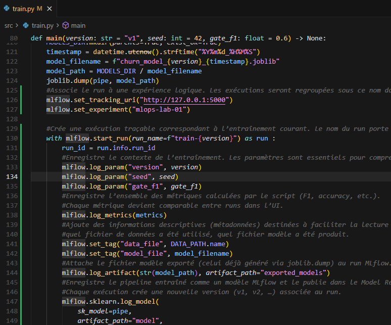
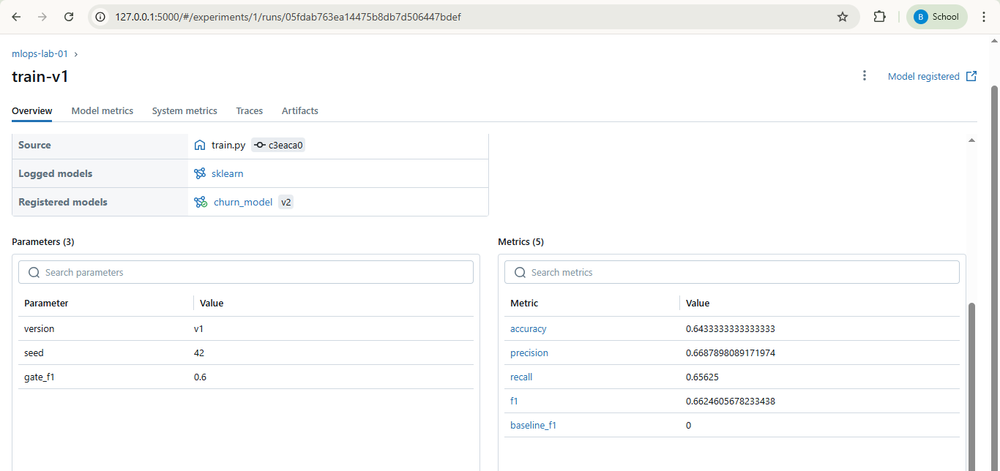
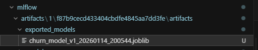

---

## Step 6 – Observation of the MLflow Model Registry
We observed the registered `churn_model` and its first version in the MLflow Model Registry.

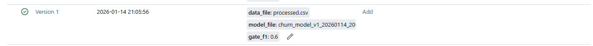

---

## Step 7 – Model Promotion
We promoted a selected model version to the production stage using the MLflow Model Registry.

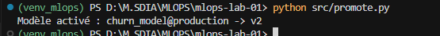
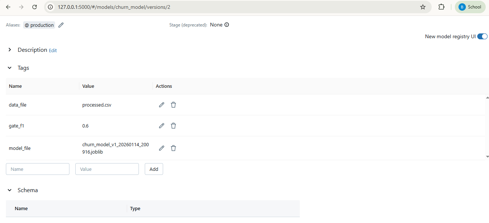

---

## Step 8 – Model Rollback
We rolled back the production stage to a previous stable model version using the MLflow Model Registry.

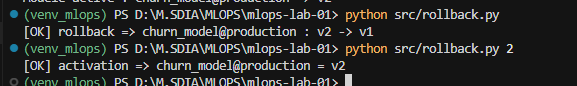
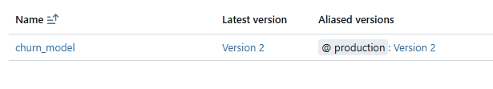

---

## Step 9 – API Loading the Active Model
We configured the API to load the currently active production model directly from the MLflow Model Registry.

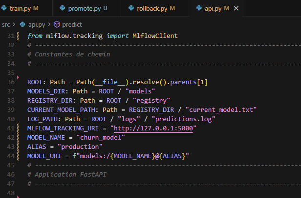
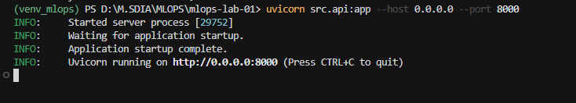
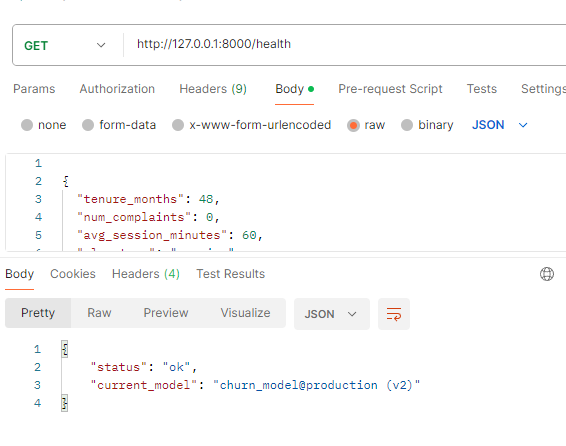

---
